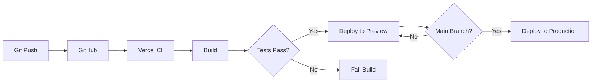

# 🏗️ Arquitectura - Aethermind Landing Page

Documentación técnica de la arquitectura y diseño del sistema.

---

## 📋 Tabla de Contenidos

- [Vista General](#vista-general)
- [Tech Stack](#tech-stack)
- [Estructura de Directorios](#estructura-de-directorios)
- [Componentes Principales](#componentes-principales)
- [Routing y Navegación](#routing-y-navegación)
- [Gestión de Estado](#gestión-de-estado)
- [Patrones de Diseño](#patrones-de-diseño)
- [Performance y Optimización](#performance-y-optimización)

---

## 🎯 Vista General

Aethermind Landing Page es una aplicación Next.js 16 con App Router, diseñada como landing page estática con formularios de autenticación que redirigen a un dashboard externo.

### Arquitectura de Alto Nivel

```
┌─────────────────────────────────────────────────────────┐
│                  Aethermind Landing Page                 │
│                    (apps/home)                           │
├─────────────────────────────────────────────────────────┤
│                                                          │
│  ┌──────────────┐  ┌──────────────┐  ┌──────────────┐ │
│  │  Pages       │  │  Components  │  │  Styles      │ │
│  │  (App Router)│  │  (React)     │  │  (Tailwind)  │ │
│  └──────────────┘  └──────────────┘  └──────────────┘ │
│                                                          │
│  ┌──────────────┐  ┌──────────────┐  ┌──────────────┐ │
│  │  Lib/Utils   │  │  Hooks       │  │  Public      │ │
│  └──────────────┘  └──────────────┘  └──────────────┘ │
│                                                          │
└─────────────────────────────────────────────────────────┘
                           │
                           │ Redirect después de auth
                           ▼
┌─────────────────────────────────────────────────────────┐
│            Dashboard Externo (Otro Repo)                 │
│   https://aethermind-agent-os-dashboard.vercel.app      │
└─────────────────────────────────────────────────────────┘
```

---

## 🛠️ Tech Stack

### Framework y Lenguaje

- **Next.js 16.0.10** - React framework con App Router
- **React 18.3.1** - UI library
- **TypeScript 5.x** - Tipado estático

### Styling

- **TailwindCSS 4.1.9** - Utility-first CSS framework
- **@tailwindcss/postcss** - PostCSS plugin
- **tailwindcss-animate** - Animaciones predefinidas
- **class-variance-authority** - Variantes de componentes

### UI Components

- **Radix UI** - 40+ componentes headless accesibles:
  - `@radix-ui/react-dialog` - Modals
  - `@radix-ui/react-dropdown-menu` - Dropdowns
  - `@radix-ui/react-navigation-menu` - Navigation
  - `@radix-ui/react-tabs` - Tabs
  - Y muchos más...

### Animaciones

- **Framer Motion** - Animaciones declarativas
- **tw-animate-css** - Utilidades de animación

### Formularios y Validación

- **React Hook Form** - Gestión de formularios
- **Zod** - Schema validation
- **@hookform/resolvers** - Integración Zod + React Hook Form

### Iconos y Assets

- **Lucide React** - Biblioteca de iconos
- **next/image** - Optimización de imágenes

### Analytics y Monitoreo

- **@vercel/analytics** - Web analytics
- **Google Analytics** (opcional) - Tracking de usuarios

---

## 📁 Estructura de Directorios

```
apps/home/
├── app/                          # App Router (Next.js 13+)
│   ├── layout.tsx                # Root layout
│   ├── page.tsx                  # Homepage
│   ├── globals.css               # Estilos globales
│   ├── login/                    # Página de login
│   │   └── page.tsx
│   ├── signup/                   # Página de signup
│   │   └── page.tsx
│   ├── about/                    # Página about
│   │   └── page.tsx
│   ├── docs/                     # Documentación
│   │   ├── page.tsx
│   │   └── api/
│   │       └── page.tsx
│   ├── onboarding/               # Flujo de onboarding
│   │   ├── welcome/
│   │   ├── demo/
│   │   ├── pricing/
│   │   └── value/
│   └── ...                       # Otras páginas
│
├── components/                   # Componentes React
│   ├── ui/                       # Componentes base (Radix)
│   │   ├── button.tsx
│   │   ├── input.tsx
│   │   ├── dialog.tsx
│   │   └── ...
│   ├── layout/                   # Layout components
│   │   ├── site-header.tsx
│   │   └── site-footer.tsx
│   ├── sections/                 # Secciones de landing
│   │   ├── intro-sequence.tsx
│   │   ├── problem-solution.tsx
│   │   ├── pricing-section.tsx
│   │   └── ...
│   └── neural-background.tsx     # Background animado
│
├── lib/                          # Utilidades
│   ├── utils.ts                  # Helper functions (cn, etc.)
│   └── ...
│
├── hooks/                        # Custom React hooks
│   ├── use-mounted.ts
│   └── use-toast.ts
│
├── public/                       # Assets estáticos
│   ├── logo.png
│   ├── favicon.ico
│   └── ...
│
├── styles/                       # Estilos adicionales
│   └── globals.css
│
├── .env.example                  # Template de variables
├── .env.local                    # Variables locales (git ignored)
├── next.config.mjs               # Config de Next.js
├── tailwind.config.ts            # Config de Tailwind
├── tsconfig.json                 # Config de TypeScript
└── package.json
```

---

## 🧩 Componentes Principales

### 1. Layout System

**Root Layout** (`app/layout.tsx`):

```typescript
export default function RootLayout({
  children,
}: {
  children: React.ReactNode;
}) {
  return (
    <html lang="es">
      <body className={inter.className}>
        <ThemeProvider>{children}</ThemeProvider>
        <Analytics />
      </body>
    </html>
  );
}
```

### 2. Page Components

**Homepage** (`app/page.tsx`):

```typescript
export default function AethermindPage() {
  return (
    <main className="relative min-h-screen bg-black text-white">
      <NeuralBackground />
      <div className="relative z-10">
        <SiteHeader />
        <IntroSequence />
        <ProblemSolution />
        <SocialProof />
        <CapacidadesSection />
        <PricingSection />
        <SiteFooter />
      </div>
    </main>
  );
}
```

### 3. UI Components (Radix-based)

**Button** (`components/ui/button.tsx`):

```typescript
import { cva, type VariantProps } from "class-variance-authority";

const buttonVariants = cva(
  "inline-flex items-center justify-center rounded-md font-medium transition-colors",
  {
    variants: {
      variant: {
        default: "bg-primary text-white hover:bg-primary/90",
        outline: "border border-input bg-background hover:bg-accent",
        ghost: "hover:bg-accent hover:text-accent-foreground",
      },
      size: {
        default: "h-10 px-4 py-2",
        sm: "h-9 rounded-md px-3",
        lg: "h-11 rounded-md px-8",
      },
    },
    defaultVariants: {
      variant: "default",
      size: "default",
    },
  }
);

export interface ButtonProps
  extends React.ButtonHTMLAttributes<HTMLButtonElement>,
    VariantProps<typeof buttonVariants> {}

export function Button({ className, variant, size, ...props }: ButtonProps) {
  return (
    <button
      className={cn(buttonVariants({ variant, size, className }))}
      {...props}
    />
  );
}
```

### 4. Secciones de Landing

**IntroSequence** (`components/intro-sequence.tsx`):

- Hero con animación de entrada
- Call-to-action principal
- Scroll indicator

**ProblemSolution** (`components/problem-solution.tsx`):

- Presenta el problema
- Muestra la solución de Aethermind
- USPs (Unique Selling Points)

**PricingSection** (`components/pricing-section.tsx`):

- Planes de pricing (Free, Pro, Enterprise)
- Comparación de features
- CTAs de signup

---

## 🛣️ Routing y Navegación

### App Router (Next.js 13+)

Usamos **file-based routing** con App Router:

```
app/
├── page.tsx           → /
├── login/
│   └── page.tsx       → /login
├── signup/
│   └── page.tsx       → /signup
├── about/
│   └── page.tsx       → /about
└── docs/
    ├── page.tsx       → /docs
    └── api/
        └── page.tsx   → /docs/api
```

### Navegación entre páginas

**Link Component**:

```typescript
import Link from "next/link";

<Link href="/login" className="...">
  Iniciar Sesión
</Link>;
```

### Redirección después de Auth

```typescript
// En login/signup exitoso
window.location.href = process.env.NEXT_PUBLIC_DASHBOARD_URL;
// Redirige a: https://aethermind-agent-os-dashboard.vercel.app
```

---

## 🔄 Gestión de Estado

### Estado Local

**useState** para estado de componentes:

```typescript
const [isOpen, setIsOpen] = useState(false);
```

### Formularios

**React Hook Form** para estado de formularios:

```typescript
const form = useForm<LoginFormData>({
  resolver: zodResolver(loginSchema),
  defaultValues: {
    email: "",
    password: "",
  },
});
```

### Validación con Zod

```typescript
const loginSchema = z.object({
  email: z.string().email("Email inválido"),
  password: z.string().min(8, "Mínimo 8 caracteres"),
});
```

### No Estado Global

⚠️ **No usamos Redux** / Context API - Landing page no necesita estado global complejo.

---

## 🎨 Patrones de Diseño

### 1. Component Composition

```typescript
// Composición en lugar de props drilling
<Dialog>
  <DialogTrigger>
    <Button>Abrir</Button>
  </DialogTrigger>
  <DialogContent>
    <DialogHeader>
      <DialogTitle>Título</DialogTitle>
    </DialogHeader>
    {/* Content */}
  </DialogContent>
</Dialog>
```

### 2. Compound Components (Radix UI)

```typescript
<Tabs defaultValue="tab1">
  <TabsList>
    <TabsTrigger value="tab1">Tab 1</TabsTrigger>
    <TabsTrigger value="tab2">Tab 2</TabsTrigger>
  </TabsList>
  <TabsContent value="tab1">Content 1</TabsContent>
  <TabsContent value="tab2">Content 2</TabsContent>
</Tabs>
```

### 3. Class Variance Authority (CVA)

```typescript
const cardVariants = cva("rounded-lg border", {
  variants: {
    variant: {
      default: "bg-white text-black",
      dark: "bg-black text-white",
    },
    size: {
      sm: "p-4",
      lg: "p-8",
    },
  },
});
```

### 4. Custom Hooks

```typescript
// hooks/use-mounted.ts
export function useMounted() {
  const [mounted, setMounted] = useState(false);

  useEffect(() => {
    setMounted(true);
  }, []);

  return mounted;
}
```

---

## ⚡ Performance y Optimización

### 1. Static Site Generation (SSG)

Todas las páginas son **pre-rendered** en build time:

```typescript
// Automático en App Router para páginas sin data fetching
export default function Page() {
  return <div>Static content</div>;
}
```

### 2. Image Optimization

```typescript
import Image from "next/image";

<Image
  src="/logo.png"
  alt="Aethermind Logo"
  width={200}
  height={50}
  priority // Para hero images
/>;
```

### 3. Code Splitting

```typescript
import dynamic from "next/dynamic";

// Lazy load de componentes pesados
const HeavyChart = dynamic(() => import("./HeavyChart"), {
  loading: () => <Skeleton />,
});
```

### 4. Fonts Optimization

```typescript
import { Inter } from "next/font/google";

const inter = Inter({
  subsets: ["latin"],
  display: "swap",
});
```

### 5. CSS-in-JS Optimization

**TailwindCSS** purga clases no usadas automáticamente en producción.

### 6. Bundle Analysis

```bash
npm run build
# Vercel muestra bundle size automáticamente
```

---

## 🔐 Seguridad

### 1. Environment Variables

```typescript
// Solo variables con NEXT_PUBLIC_ son accesibles en cliente
const dashboardUrl = process.env.NEXT_PUBLIC_DASHBOARD_URL;
```

### 2. Content Security Policy

Configurado en `next.config.mjs` (si aplica).

### 3. Form Validation

```typescript
// Client-side validation con Zod
// Server-side validation en API routes (si existen)
```

---

## 📊 Monitoreo y Analytics

### Vercel Analytics

```typescript
// app/layout.tsx
import { Analytics } from "@vercel/analytics/react";

<Analytics />;
```

### Google Analytics (Opcional)

```typescript
import { GoogleAnalytics } from "@next/third-parties/google";

<GoogleAnalytics gaId={process.env.NEXT_PUBLIC_GA_ID} />;
```

---

## 🧪 Testing Strategy

### Unit Tests (Futuro)

```typescript
// Vitest + React Testing Library
import { render, screen } from "@testing-library/react";

test("renders button", () => {
  render(<Button>Click me</Button>);
  expect(screen.getByText("Click me")).toBeInTheDocument();
});
```

### E2E Tests (Futuro)

```typescript
// Playwright
test("login flow", async ({ page }) => {
  await page.goto("/login");
  await page.fill("[name=email]", "user@example.com");
  await page.fill("[name=password]", "password123");
  await page.click("button[type=submit]");
  await expect(page).toHaveURL(/dashboard/);
});
```

---

## 🔄 CI/CD Pipeline



---

## 📝 Decisiones Arquitectónicas

### ¿Por qué Next.js 16?

- ✅ SSG para máxima performance
- ✅ App Router moderno
- ✅ Turbopack para builds rápidos
- ✅ Excelente DX (Developer Experience)

### ¿Por qué TailwindCSS?

- ✅ Utility-first approach
- ✅ Purge automático de CSS no usado
- ✅ Diseño consistente con design system
- ✅ Excelente compatibilidad con Radix UI

### ¿Por qué Radix UI?

- ✅ Componentes headless (100% customizables)
- ✅ Accesibilidad (WAI-ARIA) built-in
- ✅ Unstyled por defecto (flexibilidad total)
- ✅ Excelente soporte de TypeScript

### ¿Por qué no estado global?

- ✅ Landing page no requiere estado compartido complejo
- ✅ Menor complejidad
- ✅ Mejor performance (menos re-renders)

---

**Arquitectura diseñada para escalabilidad y maintainability** 🏗️
