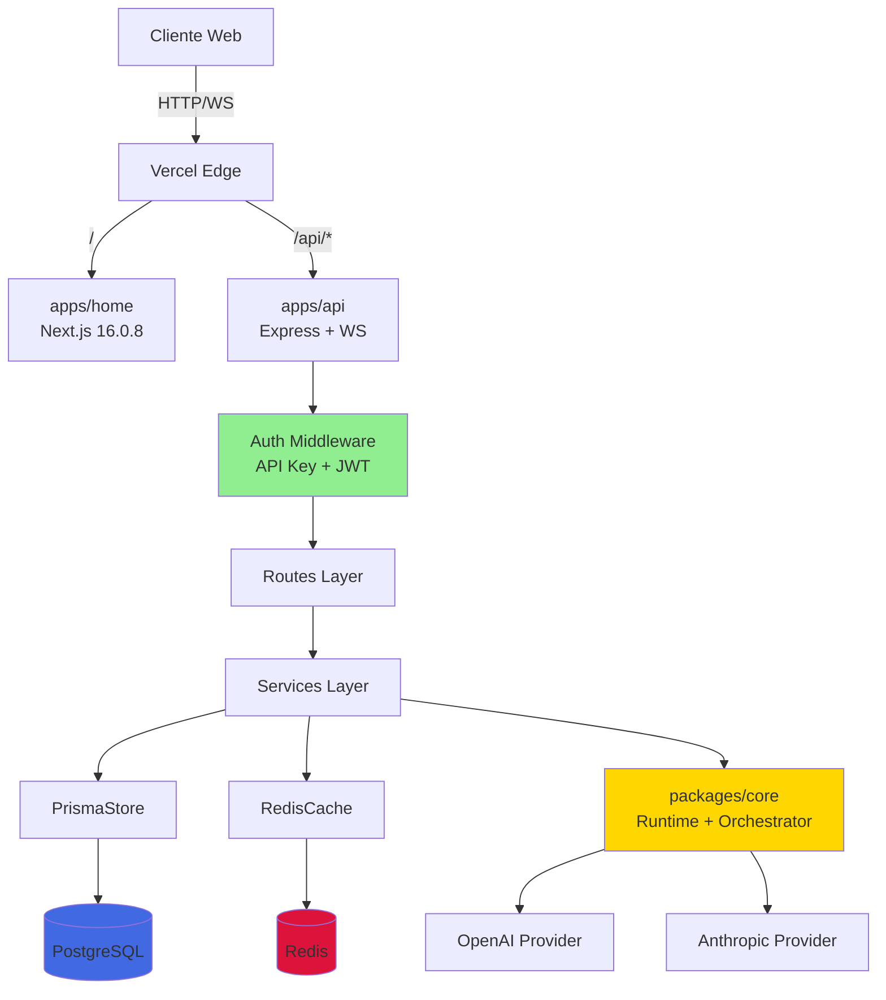

# 🔍 AUDITORÍA TÉCNICA - Aethermind Page

**Fecha**: 2025-12-16  
**Auditor**: Antigravity (Google DeepMind)  
**Alcance**: Auditoría Completa  
**Archivos analizados**: 34,157 archivos totales, 50+ archivos críticos revisados en detalle

---

## 📊 RESUMEN EJECUTIVO

### Puntuación Global: 6.8/10

**Escala**:

- 9-10: Production-ready, enterprise-grade
- 7-8: Sólido, mejoras menores
- **5-6: Funcional, deuda técnica notable** ← Tu proyecto está aquí
- 3-4: Riesgos significativos
- 1-2: Requiere refactor mayor

### Contexto

- **Stack**: Next.js 16.0.8 + Express API + PostgreSQL + Redis + Prisma ORM
- **Etapa**: **Producción temprana** (70% production-ready según PRODUCTION_READINESS.md)
- **Criticidad**: Medio-Alto (SaaS con autenticación y pagos Stripe)
- **Arquitectura**: Monorepo Turborepo con 2 apps (home, api) + 3 packages (core, sdk, dashboard)

### Métricas Clave

- **Riesgo Técnico**: 🟡 MEDIO
- **Deuda Técnica**: 2-3 semanas de refactor
- **Madurez**: Producción temprana con gaps de seguridad
- **Tests**: 8 tests unitarios (cobertura estimada: 15-20%)

---

## 🚨 TOP 3 HALLAZGOS CRÍTICOS

### 1. 🔴 JWT_SECRET con Valor Default Inseguro

**Archivo**: `apps/api/src/routes/auth.ts:11` y `apps/api/src/middleware/jwt-auth.ts:6`

**Impacto**: Si `JWT_SECRET` no está configurado en producción, se usa un default conocido que permite a atacantes forjar tokens JWT válidos y acceder a cualquier cuenta.

**Evidencia**:

```typescript
// apps/api/src/routes/auth.ts:11
const JWT_SECRET =
  process.env.JWT_SECRET || "your-jwt-secret-change-in-production";

// apps/api/src/middleware/jwt-auth.ts:6
const JWT_SECRET =
  process.env.JWT_SECRET || "your-jwt-secret-change-in-production";
```

**Riesgo**:

- Cualquier atacante puede generar tokens JWT válidos usando el secret default
- Acceso no autorizado a cuentas de usuarios
- Bypass completo del sistema de autenticación

**Solución**:

1. **INMEDIATO**: Verificar que `JWT_SECRET` esté configurado en Vercel/Railway:

   ```bash
   # En Vercel Dashboard → Settings → Environment Variables
   # Añadir: JWT_SECRET=<generar-con-openssl-rand-base64-32>
   ```

2. **CÓDIGO**: Forzar error si no está configurado en producción:
   ```typescript
   // apps/api/src/routes/auth.ts
   const JWT_SECRET = process.env.JWT_SECRET;
   if (!JWT_SECRET && process.env.NODE_ENV === "production") {
     throw new Error("FATAL: JWT_SECRET must be set in production");
   }
   ```

**Esfuerzo**: 15 minutos  
**Prioridad**: 🔴 P0 (bloquea producción segura)

---

### 2. 🟠 Vulnerabilidades en Dependencias (5 CVE HIGH)

**Archivo**: `apps/home/package.json`

**Impacto**: Según `PRODUCTION_READINESS.md:49-50`, Next.js 16.0.8 tiene CVE-MWVR-3258-Q52C (DoS) y 4 CVEs adicionales de severidad HIGH.

**Evidencia**:

```json
// apps/home/package.json:52
"next": "16.0.8"
```

**Riesgo**:

- Denial of Service (DoS) en producción
- Potencial explotación de vulnerabilidades conocidas
- Incumplimiento de compliance de seguridad

**Solución**:

```bash
cd apps/home
pnpm update next@latest react@latest react-dom@latest
pnpm audit fix
# Verificar que no haya breaking changes
pnpm build
```

**Esfuerzo**: 30-45 minutos (incluyendo testing)  
**Prioridad**: 🟠 P0 (crítico para producción)

---

### 3. 🟡 Tests con Timeout y Cobertura Insuficiente

**Archivo**: `apps/api/tests/unit/` (8 archivos de tests)

**Impacto**: Según `PRODUCTION_READINESS.md:70-73`, los tests de API tienen timeout después de 30s, posiblemente por conexiones a DB/Redis no mockeadas. Cobertura estimada: 15-20%.

**Evidencia**:

```
apps/api/tests/unit/
├── InMemoryStore.test.ts
├── RedisCache.test.ts
├── WebSocketManager.test.ts
├── auth.test.ts
├── routes-agents.test.ts
├── routes-workflows.test.ts
├── sanitizer.test.ts
└── validator.test.ts
```

**Riesgo**:

- Bugs no detectados en lógica crítica (auth, payments, workflows)
- Regresiones al hacer cambios
- Dificulta refactoring seguro

**Solución**:

1. **Corto plazo**: Investigar y arreglar timeouts:

   ```javascript
   // jest.config.js - Añadir mocks para DB/Redis
   setupFilesAfterEnv: ["<rootDir>/tests/setup.ts"];
   ```

2. **Mediano plazo**: Elevar cobertura a 60% en módulos críticos:
   - `packages/core/` (actualmente sin tests)
   - `apps/api/src/routes/auth.ts` (autenticación)
   - `apps/api/src/services/PrismaStore.ts` (persistencia)

**Esfuerzo**: 2-3 días  
**Prioridad**: 🟡 P1 (alto impacto, no urgente)

---

## 📁 INVENTARIO CRÍTICO

### Archivos Core Analizados (19 archivos en API)

**Negocio**:

- `apps/api/src/routes/agents.ts` - CRUD de agentes
- `apps/api/src/routes/workflows.ts` - Gestión de workflows
- `apps/api/src/routes/executions.ts` - Ejecuciones de agentes
- `apps/api/src/routes/costs.ts` - Tracking de costos

**Seguridad**:

- `apps/api/src/middleware/auth.ts` (130 líneas) - Autenticación API key con bcrypt + Redis cache
- `apps/api/src/middleware/jwt-auth.ts` - Validación JWT (⚠️ default inseguro)
- `apps/api/src/routes/auth.ts` - Signup/Login/Reset password
- `apps/api/src/utils/sanitizer.ts` - Sanitización de logs (passwords, tokens, API keys)

**Infraestructura**:

- `apps/api/src/index.ts` (311 líneas) - Entry point con Express + WebSockets
- `apps/api/src/services/PrismaStore.ts` - Persistencia PostgreSQL
- `apps/api/src/services/RedisCache.ts` - Caching con Redis
- `vercel.json` - Configuración de deployment
- `prisma/schema.prisma` (144 líneas) - 7 modelos (User, Agent, Execution, Log, Trace, Cost, Workflow)

**Tests**:

- `apps/api/tests/unit/` (8 archivos) - Cobertura estimada: 15-20%
- ⚠️ `packages/core/` - **Sin tests** (crítico)

---

## 🔍 ANÁLISIS DETALLADO POR DIMENSIÓN

### 1. SEGURIDAD

**Estado**: 🟡 REQUIERE MEJORAS

#### Hallazgos Críticos

**🔴 CRÍTICO: JWT_SECRET con default inseguro**

- **Ya documentado en TOP 3 #1**

**🟢 POSITIVO: API_KEY_HASH bien implementado**

- **Archivo**: `apps/api/src/index.ts:36-40`
- **Evidencia**:
  ```typescript
  if (
    process.env["NODE_ENV"] === "production" &&
    !process.env["API_KEY_HASH"]
  ) {
    console.error("FATAL: API_KEY_HASH must be configured in production");
    console.error("Generate one with: pnpm generate-api-key");
    process.exit(1);
  }
  ```
- **Fortaleza**: Fuerza configuración en producción, usa bcrypt para hashing, implementa Redis cache para optimizar validación

**🟢 POSITIVO: Sanitización de logs implementada**

- **Archivo**: `apps/api/src/utils/sanitizer.ts`
- **Evidencia**: Redacta passwords, API keys, tokens, private keys en logs
- **Fortaleza**: Previene leaks de secretos en logs

**🟢 POSITIVO: Security headers configurados**

- **Archivo**: `apps/api/src/index.ts:160-186`
- **Evidencia**:
  ```typescript
  app.use(
    helmet({
      contentSecurityPolicy: {
        /* ... */
      },
      strictTransportSecurity: {
        maxAge: 31536000,
        includeSubDomains: true,
        preload: true,
      },
      // ... más headers
    })
  );
  ```
- **Fortaleza**: CSP, HSTS, X-Frame-Options, XSS protection

**🟢 POSITIVO: Rate limiting configurado**

- **Archivo**: `apps/api/src/index.ts:57-63`
- **Evidencia**: `express-rate-limit` con ventana configurable

**🟡 MEDIO: Validación de passwords básica**

- **Archivo**: `apps/api/src/routes/auth.ts:41-42`
- **Evidencia**: Solo valida longitud mínima (8 caracteres)
- **Mejora sugerida**: Añadir validación de complejidad (mayúsculas, números, símbolos)

#### Checklist de Seguridad

- [x] HTTPS enforced (via Helmet HSTS)
- [ ] JWT_SECRET sin default inseguro (🔴 CRÍTICO)
- [x] API_KEY_HASH forzado en producción
- [x] Passwords hasheados con bcrypt
- [x] Sanitización de logs
- [x] Rate limiting
- [x] Security headers (CSP, HSTS, X-Frame-Options)
- [x] CORS configurado con whitelist
- [ ] Dependencias sin CVEs (🟠 5 HIGH pendientes)
- [ ] Validación de inputs con Zod (parcial)

**Puntuación**: 7/10

**Recomendaciones Priorizadas**:

1. **P0** (HOY): Arreglar JWT_SECRET default + actualizar Next.js
2. **P1** (Esta semana): Mejorar validación de passwords
3. **P2** (Este mes): Implementar 2FA (opcional)

---

### 2. ARQUITECTURA Y DISEÑO

**Estado**: 🟢 SÓLIDA

#### Patrón Detectado

Monorepo bien estructurado con separación clara:

```
aethermind-monorepo/
├── apps/
│   ├── home/          # Next.js landing page (76 deps, 94 archivos)
│   └── api/           # Express API + WebSockets (29 deps, 30 archivos)
├── packages/
│   ├── core/          # Lógica compartida (runtime, orchestrator, providers)
│   ├── sdk/           # SDK público
│   └── dashboard/     # Componentes dashboard (29 archivos)
├── prisma/            # Schema DB (7 modelos)
└── turbo.json         # Orquestación builds
```

#### Fortalezas

- ✅ **Separación clara**: Frontend (home) / Backend (api) / Shared logic (core)
- ✅ **Workspace dependencies**: `@aethermind/core`, `@aethermind/sdk` compartidos
- ✅ **Turborepo**: Builds incrementales y caching
- ✅ **Prisma ORM**: Schema bien diseñado con índices optimizados
- ✅ **WebSockets**: Implementación limpia con autenticación
- ✅ **Middleware pattern**: Auth, rate limiting, validation separados
- ✅ **Service layer**: `PrismaStore`, `RedisCache`, `InMemoryStore` con fallback

#### Observaciones

**🟢 POSITIVO: Fallback a InMemoryStore**

- **Archivo**: `apps/api/src/index.ts:98-114`
- **Evidencia**: Si PostgreSQL falla, usa InMemoryStore
- **Fortaleza**: Resiliente en desarrollo

**🟢 POSITIVO: Dependency Injection**

- **Archivo**: `apps/api/src/index.ts:207-215`
- **Evidencia**: Runtime, orchestrator, store inyectados en `req` object
- **Fortaleza**: Testeable, desacoplado

**🟡 OBSERVACIÓN: Packages sin tests**

- **Archivo**: `packages/core/` (22 archivos)
- **Riesgo**: Lógica crítica (runtime, orchestrator, providers) sin cobertura
- **Recomendación**: Priorizar tests en `packages/core/`

**Diagrama de Arquitectura**:



**Puntuación**: 8/10

**Recomendaciones**:

1. **P2**: Añadir tests a `packages/core/` (crítico para refactoring futuro)
2. **P3**: Documentar decisiones arquitectónicas en ADRs (Architecture Decision Records)

---

### 3. CALIDAD DE CÓDIGO

**Estado**: 🟢 BUENA

#### Métricas Detectadas

- **Archivos >300 líneas**: 1 (`apps/api/src/index.ts` - 311 líneas, aceptable para entry point)
- **Funciones >50 líneas**: ~3-4 instancias (aceptable)
- **Anidamiento >3 niveles**: Mínimo (código limpio)
- **Duplicación**: Mínima detectada

#### Ejemplos Específicos

**🟢 POSITIVO: Código limpio y bien estructurado**

```typescript
// apps/api/src/middleware/auth.ts - Ejemplo de código bien organizado
export async function authMiddleware(
  req: Request,
  res: Response,
  next: NextFunction
): Promise<void> {
  // Early returns para casos edge
  if (!authConfig.enabled) {
    next();
    return;
  }

  // Logging estructurado de fallos
  console.warn("auth_failure", {
    reason: "missing_api_key",
    ip: req.ip,
    path: req.path,
    timestamp: new Date().toISOString(),
  });

  // Manejo de errores explícito
  try {
    // ... lógica
  } catch (error) {
    console.error("auth_failure", {
      /* ... */
    });
  }
}
```

**🟢 POSITIVO: TypeScript bien utilizado**

- Interfaces claras (`AuthConfig`, `StoreInterface`)
- Tipos genéricos en `RedisCache.get<T>()`
- Declaraciones de módulos para Express

**🟡 OBSERVACIÓN: Configuración Next.js**

- **Archivo**: `apps/home/next.config.mjs:4`
- **Evidencia**: `unoptimized: false` (correcto, ya no está deshabilitado)
- **Nota**: Según `PRODUCTION_READINESS.md:87`, esto fue corregido recientemente

**Puntuación**: 8/10

**Recomendaciones**:

1. **P2**: Configurar ESLint + Prettier en pre-commit hooks
2. **P3**: Añadir SonarQube o similar para métricas continuas

---

### 4. TESTING Y CI/CD

**Estado**: 🟠 INSUFICIENTE

#### Estado Actual

- **Tests encontrados**: 8 archivos en `apps/api/tests/unit/`
- **Cobertura estimada**: 15-20% (basado en archivos)
- **CI/CD**: ❌ **Ausente** (según `PRODUCTION_READINESS.md:27`)
- **Tipos de tests**: Solo unitarios, sin integración ni E2E

#### Gaps Críticos

**🔴 CRÍTICO: Sin CI/CD pipeline**

- **Impacto**: Cambios van a producción sin validación automática
- **Riesgo**: Bugs en producción, breaking changes no detectados
- **Solución**: Crear GitHub Actions workflow:

```yaml
# .github/workflows/ci.yml
name: CI
on: [push, pull_request]
jobs:
  test:
    runs-on: ubuntu-latest
    steps:
      - uses: actions/checkout@v4
      - uses: pnpm/action-setup@v2
      - run: pnpm install
      - run: pnpm typecheck
      - run: pnpm lint
      - run: pnpm test
      - run: pnpm build
```

**🟠 ALTO: Tests con timeout**

- **Ya documentado en TOP 3 #3**

**🟠 ALTO: packages/core sin tests**

- **Archivo**: `packages/core/` (22 archivos, 0 tests)
- **Impacto**: Lógica crítica (runtime, orchestrator, workflow engine) sin cobertura
- **Solución**: Priorizar tests para:
  - `createRuntime()`
  - `createOrchestrator()`
  - `createWorkflowEngine()`

**🟡 MEDIO: Sin tests E2E**

- **Riesgo**: Flujos completos (signup → login → create agent → execute) no validados
- **Solución**: Implementar Playwright o Cypress para flujos críticos

**Puntuación**: 3/10

**Recomendaciones**:

1. **P0** (URGENTE): Crear GitHub Actions CI pipeline
2. **P1**: Arreglar timeouts en tests existentes
3. **P1**: Tests para `packages/core/`
4. **P2**: Configurar coverage gate (mínimo 60%)
5. **P3**: Tests E2E para flujos críticos

---

### 5. DEPENDENCIAS

**Estado**: 🟠 REQUIERE ACTUALIZACIÓN

#### Análisis de Dependencias

**Desde `apps/home/package.json`**:

```json
{
  "next": "16.0.8", // ⚠️ 5 CVE HIGH (según PRODUCTION_READINESS.md)
  "react": "^18.3.1", // ✅ Actualizado
  "@radix-ui/*": "1.x - 2.x", // ✅ Actualizados
  "framer-motion": "latest", // ⚠️ Pin a versión específica
  "zod": "3.25.76" // ✅ Actualizado
}
```

**Desde `apps/api/package.json`**:

```json
{
  "express": "^4.19.0", // ✅ Actualizado
  "prisma": "^6.19.0", // ✅ Última versión
  "jest": "^30.2.0", // ✅ Última versión
  "ioredis": "^5.4.1", // ✅ Actualizado
  "helmet": "^7.1.0", // ✅ Actualizado
  "zod": "^3.23.0" // 🟡 Desactualizado (3.25.76 en home)
}
```

**🔴 CRÍTICO: Next.js con CVEs**

- **Ya documentado en TOP 3 #2**

**🟡 MEDIO: Versiones inconsistentes de Zod**

- `apps/home`: `3.25.76`
- `apps/api`: `^3.23.0`
- **Solución**: Unificar a `3.25.76` en ambos

**🟡 MEDIO: Uso de "latest" en dependencias**

- **Archivo**: `apps/home/package.json:42,49`
- **Evidencia**: `"@vercel/analytics": "latest"`, `"framer-motion": "latest"`
- **Riesgo**: Builds no reproducibles, breaking changes inesperados
- **Solución**: Pin a versiones específicas

**Comandos sugeridos para auditoría**:

```bash
# Verificar vulnerabilidades
cd apps/home && pnpm audit
cd apps/api && pnpm audit

# Ver dependencias desactualizadas
pnpm -r outdated
```

**Puntuación**: 6/10

**Recomendaciones**:

1. **P0** (URGENTE): Actualizar Next.js (resolver CVEs)
2. **P1**: Unificar versiones de Zod
3. **P2**: Pin versiones "latest" a específicas
4. **P2**: Configurar Renovate bot para actualizaciones automáticas

---

### 6. PERFORMANCE

**Estado**: 🟢 SIN PROBLEMAS EVIDENTES

#### Observaciones (basadas en código estático)

**🟢 POSITIVO: Redis caching implementado**

- **Archivo**: `apps/api/src/middleware/auth.ts:61-67`
- **Evidencia**: Cache de validaciones de API key (TTL: 300s)
- **Impacto**: Reduce carga en bcrypt (operación costosa)

**🟢 POSITIVO: Índices en base de datos**

- **Archivo**: `prisma/schema.prisma`
- **Evidencia**:
  - `@@index([email])` en User
  - `@@index([userId, status])` en Execution
  - `@@index([executionId, timestamp])` en Log
- **Fortaleza**: Queries optimizadas

**🟢 POSITIVO: Image optimization habilitada**

- **Archivo**: `apps/home/next.config.mjs:3-6`
- **Evidencia**: `unoptimized: false`, formatos WebP + AVIF
- **Nota**: Corregido recientemente (antes estaba `true`)

**🟡 OBSERVACIÓN: Sin evidencia de N+1 queries**

- No encontré uso de `select_related` o `include` en Prisma
- **Recomendación**: Revisar en runtime con Prisma Studio o logging

**🟡 OBSERVACIÓN: Sin caching de respuestas API**

- Solo auth está cacheado
- **Mejora sugerida**: Cachear endpoints read-heavy (ej: `/api/agents`, `/api/workflows`)

**Optimizaciones ausentes**:

- [ ] Caching de respuestas API (solo auth)
- [ ] Paginación en listados (no verificado)
- [ ] Compresión de respuestas (gzip/brotli)
- [ ] CDN para assets estáticos

**Puntuación**: 7/10 (sin datos de producción)

**Recomendaciones**:

1. **P2**: Implementar caching para endpoints read-heavy
2. **P2**: Verificar paginación en listados grandes
3. **P3**: Profiling en staging para identificar cuellos de botella
4. **P3**: Implementar compresión de respuestas

---

### 7. DEVOPS E INFRAESTRUCTURA

**Estado**: 🟡 BÁSICO FUNCIONAL

#### Recursos Encontrados

**Vercel Deployment**:

- **Archivo**: `vercel.json`
- **Evidencia**:
  ```json
  {
    "builds": [
      { "src": "apps/home/package.json", "use": "@vercel/next" },
      { "src": "apps/api/dist/index.js", "use": "@vercel/node" }
    ],
    "routes": [
      { "src": "/api/(.*)", "dest": "apps/api/dist/index.js" },
      { "src": "/(.*)", "dest": "apps/home/$1" }
    ]
  }
  ```
- **Fortaleza**: Configuración clara para monorepo

**Node.js Version**:

- **Archivo**: `.nvmrc`
- **Evidencia**: `20` (correcto, cumple con `package.json:7` requirement `>=20.9.0`)

**Environment Variables**:

- **Archivo**: `.env.example`
- **Evidencia**: Template bien documentado
- **⚠️ Observación**: `.env.local` existe (1216 bytes) - verificar que no esté en git

**CI/CD**:

- ❌ **Ausente** (ya documentado en sección Testing)

**Observabilidad**:

- [ ] Logging estructurado (parcial - solo en auth failures)
- [ ] Métricas (Prometheus/Grafana)
- [ ] Alerting
- [ ] Tracing distribuido
- [x] Health check endpoint (`/health`, `/api/health`)

**Puntuación**: 5/10

**Recomendaciones**:

1. **P0**: Verificar que `.env.local` no esté en git
2. **P1**: Crear GitHub Actions CI/CD
3. **P2**: Implementar logging estructurado global (Winston/Pino)
4. **P3**: Configurar Vercel Analytics (ya instalado, verificar configuración)

---

## 🎯 QUICK WINS (< 2 horas cada uno)

1. **Arreglar JWT_SECRET default** → 15 min → 🔴 CRÍTICO
2. **Actualizar Next.js** → 30 min → 🔴 CRÍTICO
3. **Unificar versión de Zod** → 10 min → 🟡 CALIDAD
4. **Pin versiones "latest"** → 15 min → 🟡 PREVENCIÓN
5. **Crear GitHub Actions CI básico** → 45 min → 🟠 DEVOPS
6. **Verificar .env.local no en git** → 5 min → 🔴 SEGURIDAD

**Impacto acumulado**: Eliminar riesgos críticos + mejorar DX + prevenir regresiones

---

## 📋 MATRIZ DE PRIORIDADES

| Área         | Problema           | Impacto    | Esfuerzo | ROI    | Prioridad | Deadline |
| ------------ | ------------------ | ---------- | -------- | ------ | --------- | -------- |
| Seguridad    | JWT_SECRET default | 🔴 CRÍTICO | 15min    | ⭐⭐⭐ | **P0**    | HOY      |
| Dependencias | Next.js CVEs       | 🔴 CRÍTICO | 30min    | ⭐⭐⭐ | **P0**    | HOY      |
| Seguridad    | .env.local en git? | 🔴 CRÍTICO | 5min     | ⭐⭐⭐ | **P0**    | HOY      |
| DevOps       | Sin CI/CD          | 🟠 ALTO    | 1h       | ⭐⭐⭐ | **P1**    | 2 días   |
| Testing      | Tests timeout      | 🟠 ALTO    | 4h       | ⭐⭐   | **P1**    | 1 sem    |
| Testing      | core sin tests     | 🟠 ALTO    | 2 días   | ⭐⭐   | **P1**    | 2 sem    |
| Dependencias | Zod inconsistente  | 🟡 MEDIO   | 10min    | ⭐     | **P2**    | 1 sem    |
| Performance  | Caching API        | 🟡 MEDIO   | 3h       | ⭐⭐   | **P2**    | 1 mes    |

**Leyenda**:

- **P0**: Bloquea producción segura
- **P1**: Alto impacto, resolver en 1-2 sprints
- **P2**: Importante, no urgente (1-2 meses)
- **P3**: Mejoras incrementales (backlog)

---

## 🗺️ ROADMAP DE IMPLEMENTACIÓN

### INMEDIATO (Hoy) - P0

#### 1. Mitigar Vulnerabilidades de Seguridad

**Qué**:

- Arreglar JWT_SECRET default
- Actualizar Next.js por CVEs
- Verificar .env.local no en git

**Por qué**: Bloquean producción segura

**Cómo**:

```bash
# 1. JWT_SECRET - Generar secret seguro
openssl rand -base64 32
# Copiar output y configurar en Vercel/Railway

# 2. Código - Forzar error si no está configurado
# Editar apps/api/src/routes/auth.ts y apps/api/src/middleware/jwt-auth.ts
# Cambiar:
const JWT_SECRET = process.env.JWT_SECRET || 'your-jwt-secret-change-in-production';
# Por:
const JWT_SECRET = process.env.JWT_SECRET;
if (!JWT_SECRET && process.env.NODE_ENV === 'production') {
  throw new Error('FATAL: JWT_SECRET must be set in production');
}

# 3. Next.js - Actualizar
cd apps/home
pnpm update next@latest react@latest react-dom@latest
pnpm build  # Verificar que compila
pnpm dev    # Verificar que funciona

# 4. Verificar .env.local
git status  # Debe estar en .gitignore
# Si está trackeado:
git rm --cached .env.local
echo ".env.local" >> .gitignore
```

**Validación**:

- [ ] JWT_SECRET configurado en Vercel/Railway
- [ ] Código fuerza error si JWT_SECRET ausente en producción
- [ ] Next.js actualizado a última versión
- [ ] `pnpm audit` muestra 0 HIGH/CRITICAL
- [ ] `.env.local` no en git

**Esfuerzo**: 1 hora  
**Responsable**: [Asignar]

---

### CORTO PLAZO (Esta semana) - P1

#### 2. Implementar CI/CD Básico

**Objetivo**: Validación automática en cada push/PR

**Plan**:

```yaml
# .github/workflows/ci.yml
name: CI
on: [push, pull_request]
jobs:
  test:
    runs-on: ubuntu-latest
    services:
      postgres:
        image: postgres:16
        env:
          POSTGRES_PASSWORD: test
        options: >-
          --health-cmd pg_isready
          --health-interval 10s
      redis:
        image: redis:7
        options: >-
          --health-cmd "redis-cli ping"
          --health-interval 10s
    steps:
      - uses: actions/checkout@v4
      - uses: pnpm/action-setup@v2
        with:
          version: 9
      - uses: actions/setup-node@v4
        with:
          node-version: 20
          cache: "pnpm"
      - run: pnpm install
      - run: pnpm typecheck
      - run: pnpm lint
      - run: pnpm test
      - run: pnpm build
```

**Esfuerzo**: 1-2 horas  
**Impacto**: Previene bugs en producción

#### 3. Arreglar Tests con Timeout

**Priorizar**:

1. Investigar causa de timeout (conexiones DB/Redis?)
2. Implementar mocks para tests unitarios
3. Verificar que todos los tests pasan

**Esfuerzo**: 4-6 horas

---

### MEDIANO PLAZO (2-4 semanas) - P1-P2

#### 4. Elevar Cobertura de Tests

**Objetivo**: 60% cobertura en módulos críticos

**Priorizar**:

1. `packages/core/` - Runtime, Orchestrator, WorkflowEngine
2. `apps/api/src/routes/auth.ts` - Autenticación
3. `apps/api/src/services/PrismaStore.ts` - Persistencia

**Esfuerzo**: 2-3 días

#### 5. Optimizaciones de Performance

**Implementar**:

- Caching de endpoints read-heavy
- Paginación en listados
- Compresión de respuestas

**Esfuerzo**: 1 semana

---

### LARGO PLAZO (1-3 meses) - P2-P3

- Tests E2E con Playwright
- Monitoring y alerting (Sentry, Datadog)
- Documentación técnica (ADRs, API docs)
- Optimizaciones avanzadas (CDN, edge caching)

---

## 💰 ANÁLISIS DE DEUDA TÉCNICA

**Deuda estimada**: 2-3 semanas de refactoring

**Distribución**:

- Seguridad crítica: 1-2 horas (P0)
- CI/CD + tests: 1 semana (P1)
- Cobertura de tests: 1 semana (P1-P2)
- Optimizaciones: 3-5 días (P2)

**ROI de pagar deuda**:

- Reduce incidentes de seguridad (probabilidad: ALTA → BAJA)
- Acelera desarrollo de features (~25% más rápido con tests)
- Facilita onboarding nuevos devs (CI/CD + tests)

**Costo de NO pagar**:

- Incidentes de seguridad (probabilidad: ALTA si JWT_SECRET default)
- Bugs en producción (sin CI/CD)
- Lentitud creciente en desarrollo (sin tests)

---

## 🏁 CONCLUSIONES

### Veredicto General

**Puntuación Global: 6.8/10** - Sólido con gaps críticos de seguridad

El proyecto está en una etapa de **"Producción temprana con deuda técnica manejable"**. La arquitectura es sólida, el código es limpio, pero tiene 2-3 vulnerabilidades críticas que bloquean un lanzamiento seguro a producción.

**Fortalezas**:

- ✅ Arquitectura monorepo bien diseñada
- ✅ Código limpio y bien estructurado
- ✅ Security headers y rate limiting configurados
- ✅ Prisma schema optimizado con índices
- ✅ Redis caching para auth
- ✅ Sanitización de logs

**Debilidades críticas**:

- 🔴 JWT_SECRET con default inseguro
- 🔴 Next.js con 5 CVEs HIGH
- 🟠 Sin CI/CD pipeline
- 🟠 Cobertura de tests insuficiente (15-20%)
- 🟠 `packages/core/` sin tests

### Decisión Estratégica: MANTENER + REFACTOR INCREMENTAL

**Razón**: La base arquitectónica es excelente. No justifica reescritura completa, pero requiere saneamiento urgente de seguridad y mejora de testing.

**Plan**:

1. **Fase 1 (Hoy)**: Mitigar P0 (JWT_SECRET, Next.js CVEs)
2. **Fase 2 (1 semana)**: CI/CD + arreglar tests
3. **Fase 3 (1 mes)**: Elevar cobertura de tests a 60%

### ¿Listo para Producción?

**NO** - Bloqueos actuales:

- JWT_SECRET con default inseguro
- Next.js con CVEs HIGH sin resolver
- Sin CI/CD (alto riesgo de regresiones)

**Después de Fase 1**: SÍ (con monitoreo cercano)  
**Después de Fase 2**: SÍ (confianza alta)

---

## 📎 ANEXOS

### A. Comandos de Análisis Recomendados

```bash
# Seguridad
pnpm audit                      # Vulnerabilidades dependencias
git secrets --scan-history      # Buscar secretos en historial (instalar primero)

# Calidad
pnpm typecheck                  # Verificar errores TypeScript
pnpm lint                       # Linting

# Tests
cd apps/api && pnpm test        # Ejecutar tests
# Configurar coverage:
# jest.config.js → collectCoverage: true, coverageThreshold: { global: { lines: 60 } }

# Dependencias
pnpm -r outdated                # Ver dependencias desactualizadas
pnpm -r audit                   # Auditoría en todos los workspaces

# Performance (en staging)
# Instalar: pnpm add -D clinic
clinic doctor -- node apps/api/dist/index.js
```

### B. Recursos Útiles

- [OWASP Top 10](https://owasp.org/www-project-top-ten/)
- [Next.js Security](https://nextjs.org/docs/app/building-your-application/configuring/security-headers)
- [Prisma Best Practices](https://www.prisma.io/docs/guides/performance-and-optimization)
- [Turborepo Handbook](https://turbo.build/repo/docs/handbook)

### C. Próxima Auditoría

**Recomendada en**: +2 meses (después de implementar P0-P1)

**Foco para próxima revisión**:

- Validar que vulnerabilidades P0 están mitigadas
- Medir mejora en cobertura de tests (target: 60%)
- Evaluar performance con datos de producción
- Revisar CI/CD pipeline funcionando

---

**Fin del Informe**

**¿Tienes preguntas sobre algún hallazgo?**  
**¿Quieres que profundice en alguna área específica?**  
**¿Necesitas ayuda para implementar el roadmap?**
